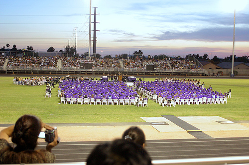
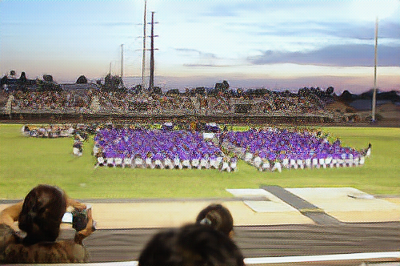

# SRNTT: Image Super-Resolution by Neural Texture Transfer
Tensorflow implementation of the paper [Image Super-Resolution by Neural Texture Transfer](https://zzutk.github.io/SRNTT-Project-Page/cvpr2019_final.pdf) accepted in CVPR 2019.
This is a simplified version, where the reference images are used without augmentation, e.g., rotation and scaling.

[Project Page](https://zzutk.github.io/SRNTT-Project-Page/)


## Contents
* [Pre-requisites](#Pre-requisites)
* [Dataset](#Dataset)
    * [Training set](#Training_set)
    * [Testing set](#Testing_set)
* [Easy testing](#Easy_testing)
* [Custom testing](#Custom_testing)
* [Easy training](#Easy_training)
* [Custom training](#Custom_training)
* [Acknowledgement](#Acknowledgement)
* [Contact](#Contact)

<a name="Pre-requisites">

## Pre-requisites

* Python 3.6
* TensorFlow 1.13.1
* requests 2.21.0
* pillow 5.4.1
* matplotlib 3.0.2

Tested on MacOS (Mojave).

<a name="Dataset">

## Dataset

<a name="Training_set">

* #### Training set
This repo only provides a small training set of ten input-reference pairs for demo purpose. 
The input images and reference images are stored in `data/train/CUFED/input` and `data/train/CUFED/ref`, respectively.
Corresponding input and refernece images are with the same file name. 
To speed up the training process, patch matching and swapping are performed offline, 
and the swapped feature maps will be saved to `data/train/CUFED/map_321` (see [`offline_patchMatch_textureSwap.py`](offline_patchMatch_textureSwap.py) for more details). 
If you want to train your own model, please prepare your own training set or download either of the following demo training sets:

##### 11,485 input-reference pairs (size 320x320) extracted from [DIV2K](https://data.vision.ee.ethz.ch/cvl/DIV2K/). 
Each pair is extracted from the same image without overlap but considering scaling and rotation. 

```bash
$ python download_dataset.py --dataset_name DIV2K
```

##### 11,871 input-reference pairs (size 160x160) extracted from [CUFED](http://acsweb.ucsd.edu/~yuw176/event-curation.html).
Each pair is extracted from the similar images, including five degrees of similarity. 

```bash
$ python download_dataset.py --dataset_name CUFED
```

<a name="Testing_set">

* #### Testing set
This repo includes one grounp of samples from the [CUFED5](https://drive.google.com/open?id=1Fa1mopExA9YGG1RxrCZZn7QFTYXLx6ph) dataset, 
where each input image corresponds to five reference images (different from the paper) with different degrees of similarity to the input image. 
Please download the full dataset by

```bash
$ python download_dataset.py --dataset_name CUFED5
```

<a name="Easy_testing">

## Easy Testing

```bash
$ sh test.sh
```

The results will be save to the folder `demo_testing_srntt`, including the following 6 images:
* [1/6] `HR.png`, the original image.

  

* [2/6] `LR.png`, the low-resolution (LR) image, downscaling factor 4x.

  
  
* [3/6] `Bicubic.png`, the upscaled image by bicubic interpolation, upscaling factor 4x.

  
  
* [4/6] `Ref_XX.png`, the reference images, indexed by XX.

  
  
* [5/6] `Upscale.png`, the upscaled image by a pre-trained SR network, upscaling factor 4x.

  
  
* [6/6] `SRNTT.png`, the SR result by SRNTT, upscaling factor 4x.

  

<a name="Custom_testing">

## Custom Testing
```bash
$ python main.py 
    --is_train              False 
    --input_dir             path/to/input/image/file
    --ref_dir               path/to/ref/image/file
    --result_dir            path/to/result/folder
    --ref_scale             default 1, expected_ref_scale divided by original_ref_scale
    --is_original_image     default True, whether input is original 
    --use_init_model_only   default False, whether use init model, trained with reconstruction loss only
    --use_weight_map        defualt False, whether use weighted model, trained with the weight map.
    --save_dir              path/to/a/specified/model if it exists, otherwise ignor this parameter
```

Please note that this repo provides two types of pre-trained SRNTT models in `SRNTT/models/SRNTT`:
* `srntt.npz` is trained by all losses, i.e., reconstruction loss, perceptual loss, texture loss, and adversarial loss.
* `srntt_init.npz` is trained by only the reconstruction loss, corresponding to SRNTT-l2 in the paper. 

To switch between the demo models, please set `--use_init_model_only` to decide whether use `srntt_init.npz`.
<a name="Easy_training">

## Easy Training

```bash
$ sh train.sh
```

The CUFED training set will be downloaded automatically.
To speed up the training process, patch matching and swapping are conducted to get the swapped feature maps in an offline manner.
The models will be saved to `demo_training_srntt/model`, and intermediate samples will be saved to `demo_training_srntt/sample`.
Parameter settings are save to `demo_training_srntt/arguments.txt`.

<a name="Custom_training">

## Custom Training
Please first prepare the input and reference images which are squared patches in the same size.
In addition, input and reference images should be stored in separated folders,
and the correspoinding input and reference images are with the same file name. Please refer to the `data/train/CUFED` folder for examples.
Then, use `offline_patchMatch_textureSwap.py` to generate the feature maps in ahead.

```bash
$ python main.py
    --is_train True
    --save_dir folder/to/save/models
    --input_dir path/to/input/image/folder
    --ref_dir path/to/ref/image/folder
    --map_dir path/to/feature_map/folder
    --batch_size default 9
    --num_epochs default 100
    --input_size default 40, the size of LR patch, i.e., 1/4 of the HR image, set to 80 for the DIV2K dataset
    --use_weight_map defualt False, whether use the weight map that reduces negative effect 
                     from the reference image but may also decrease the sharpness.  
```
Please refer to `main.py` for more parameter settings for training.

Test on the custom training model
```bash
$ python main.py 
    --is_train              False 
    --input_dir             path/to/input/image/file
    --ref_dir               path/to/ref/image/file
    --result_dir            path/to/result/folder
    --ref_scale             default 1, expected_ref_scale divided by original_ref_scale
    --is_original_image     default True, whether input is original 
    --save_dir              the same as save_dir in training
```

<a name="Acknowledgement">

## Acknowledgement
Thanks to [Tensorlayer](https://github.com/tensorlayer/tensorlayer) for 
facilitating the implementation of this demo code. 
We have include the Tensorlayer 1.5.0 in `SRNTT/tensorlayer`.

<a name="Contact">

## Contact
[Zhifei Zhang](https://zzutk.github.io/)


